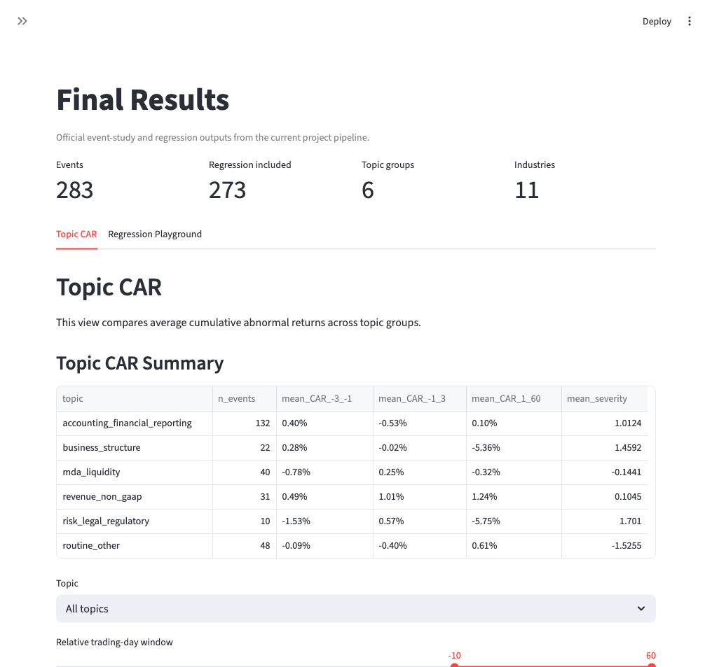
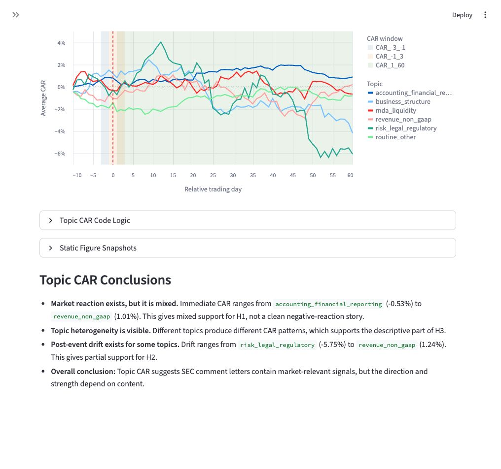
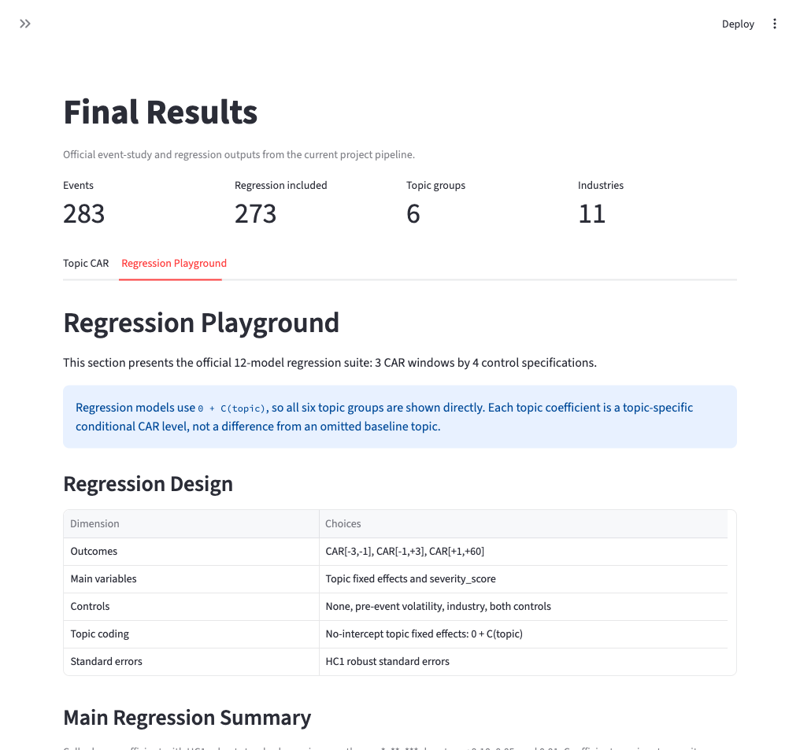
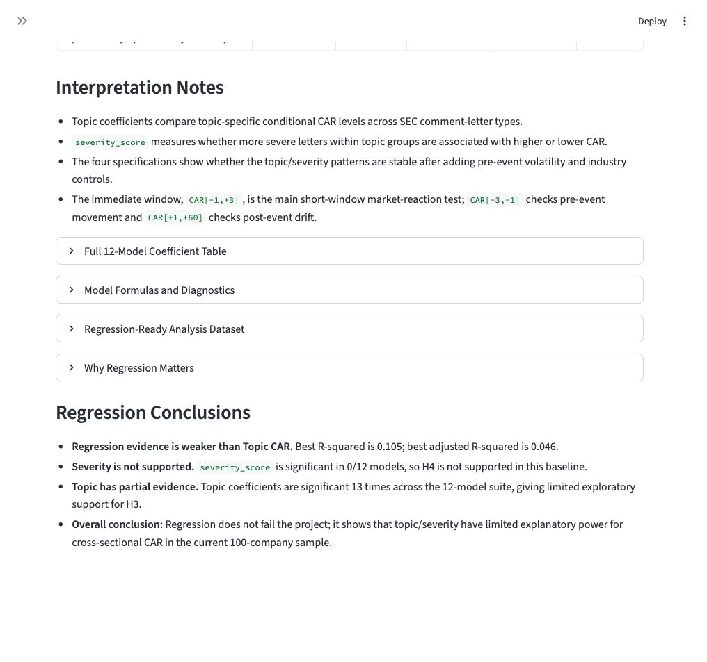

# SEC Comment Letter Radar: Final Results Brief

This brief summarizes the two final-results sections of the Streamlit dashboard for team communication:

- Topic CAR
- Regression Playground

The goal is to explain what each page shows, what the main numeric results mean, and how the results answer the project research question.

## Research Question

Do SEC comment letters contain regulatory signals that are reflected in stock returns, and do topic and severity measures explain variation in market reaction?

## Hypotheses

| Hypothesis | Question |
|---|---|
| H1: Market reaction | Do SEC comment-letter events have abnormal stock-return reactions around the event date? |
| H2: Post-event drift | Do abnormal returns continue after the immediate event window? |
| H3: Topic heterogeneity | Do different comment-letter topics produce different CAR patterns? |
| H4: Severity effect | Are more severe comment letters associated with stronger CAR reactions? |

## 1. Topic CAR Page



### What This Page Shows

The Topic CAR page is the event-study result page. It groups events by the V3 topic classifier and compares average cumulative abnormal returns across topics and event windows.

The main table reports topic-level mean CAR for three windows:

| Window | Interpretation |
|---|---|
| `mean_CAR_-3_-1` | Pre-event movement before the SEC comment-letter event |
| `mean_CAR_-1_3` | Immediate market reaction around the event date |
| `mean_CAR_1_60` | Post-event drift after the event |

The line charts show average CAR over relative trading days. The shaded windows help connect the visual event-study curve to the three CAR windows used in the summary table.



### Main Numeric Results

| Result | Value |
|---|---|
| Lowest immediate CAR, `CAR_-1_3` | `accounting_financial_reporting`: -0.53% |
| Highest immediate CAR, `CAR_-1_3` | `revenue_non_gaap`: +1.01% |
| Lowest post-event drift, `CAR_1_60` | `risk_legal_regulatory`: -5.75% |
| Highest post-event drift, `CAR_1_60` | `revenue_non_gaap`: +1.24% |

### Topic CAR Interpretation

- Market reaction exists, but it is mixed rather than uniformly negative.
- Topic heterogeneity is visible: different comment-letter topics show different CAR patterns.
- The strongest descriptive post-event drift is negative for `risk_legal_regulatory` and positive for `revenue_non_gaap`.
- Topic CAR provides descriptive support for H2 and H3, while H1 is only partially supported because the direction is not uniformly negative.

### How to Explain This to Teammates

Topic CAR answers the descriptive event-study question:

> Around SEC comment-letter events, do returns move differently depending on what the letter is about?

The answer from the current baseline sample is yes, but the pattern is not one simple negative effect. Topic matters descriptively, and the strongest visual evidence is that market reaction differs across letter content categories.

## 2. Regression Playground Page



### What This Page Shows

The Regression Playground is the formal empirical-test page. It asks whether the CAR differences observed in the event study can be explained by comment-letter content features.

The backend runs 12 regression models:

| Dimension | Choices |
|---|---|
| CAR windows | `CAR_-3_-1`, `CAR_-1_3`, `CAR_1_60` |
| Specifications | topic + severity; plus pre-event volatility; plus industry; plus both controls |

The general formula is:

```text
CAR_window ~ 0 + C(topic) + severity_score + optional controls
```

The `0 + C(topic)` design means all topic coefficients are displayed directly. There is no hidden omitted baseline topic. Each topic coefficient can be read as that topic's conditional CAR level, holding included controls fixed.

### How to Read the Regression Table

| Table element | Meaning |
|---|---|
| Coefficient | Estimated relationship between a variable and CAR |
| Parentheses | Robust standard error, not p-value |
| Stars | Statistical significance based on p-value |
| R-squared | Share of CAR variation explained by the model |
| Adjusted R-squared | R-squared adjusted for model complexity |



### Main Numeric Results

| Result | Value |
|---|---|
| Number of regression models | 12 |
| Severity significant models | 0 / 12 |
| Topic coefficient significant occurrences | 13 |
| Highest R-squared | 0.105 |
| Highest adjusted R-squared | 0.046 |

### Regression Interpretation

- Regression evidence is weaker than Topic CAR evidence.
- `severity_score` is not statistically supported in this baseline: it is significant in 0 out of 12 models.
- Topic has partial exploratory evidence: some topic coefficients are statistically significant, but the pattern is not strong enough for a broad causal claim.
- The highest adjusted R-squared is 0.046, so the models explain only a small share of cross-sectional CAR variation.

### How to Explain This to Teammates

Regression answers a stricter question than the event study:

> Are the differences in CAR systematically explained by topic and severity after adding controls?

The current answer is modest. Topic appears more useful than severity, but the regression results are not strong enough to claim that topic and severity fully explain market reactions.

This does not mean the project failed. It means the event-study signal is more visually and descriptively clear than the cross-sectional regression evidence in the current 100-company baseline sample.

## Combined Takeaway

| Component | Role | Current conclusion |
|---|---|---|
| Topic CAR | Descriptive event-study evidence | Market reactions differ by topic |
| Regression Playground | Formal cross-sectional test | Topic has partial evidence; severity is not supported |

The strongest presentation claim is:

> SEC comment-letter events show topic-specific market-reaction patterns. However, in the current baseline sample, topic and severity only partially explain cross-sectional CAR variation in formal regressions.

## Suggested Presentation Framing

- Lead with Topic CAR because it is easier to understand visually and directly connects to the event-study design.
- Use Regression Playground as the formal robustness layer.
- Do not overclaim statistical significance. The regression results are useful because they show what the current evidence can and cannot support.
- State clearly that this is a baseline 100-company project version. A larger S&P 500 version may improve power and stability.

## Source Notes

- Screenshots were taken from the local Streamlit dashboard at `http://localhost:8501/Final_Results`.
- Topic CAR values come from the project output table `outputs/tables/topic_car_summary.csv`.
- Regression results come from the 12-model backend regression suite in `outputs/tables/regression_coefficients_long.csv` and `outputs/tables/regression_model_summary.csv`.
